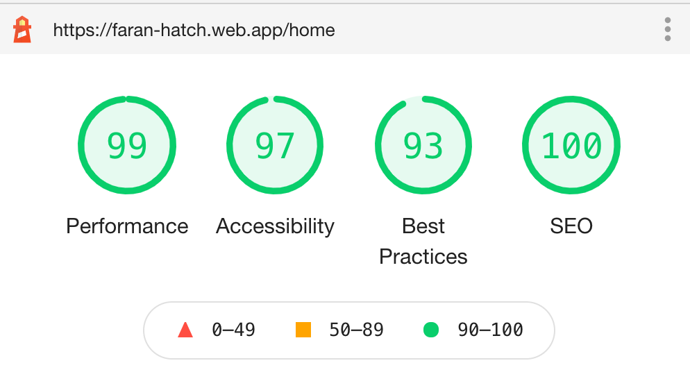

# React-Item-List

> Designed and implemented a production ready mobile first responsive application for displaying list of items.
> Technology used: `React 17`, `Tailwind CSS`, `React-Query`

---

# 🚀 [Live-Demo](https://faran-hatch.web.app/home)

## Table of Contents

- [Installation](#installation)
- [Features](#features)
- [Gifs](#gifs)
- [BrowserList](#browserlist)

---

## Installation

> To proceed with smooth installation you should have Node 15+ version installed in your system

> Clone the repo. After that please navigate to project folder folder and run below command to install `node_modules` in order to run this app locally.

```shell
$ npm ci
```

> Once node dependencies are installed then please open your terminal and run `npm start` for spinning up the development server.
> Navigate to `http://localhost:3000/`.
> The app will automatically launch if you change any of the source files.

---

## Features

> Expected functionalities:

- Architected the app with `domain-driven-development` approach
- Created a reusable `ItemList` component
- Used `RickAndMorty` api to demonstrate its usage
- Created reusable `SidePanel` component to show more details of the list item
- Provdied the search functionality

> Additional functionalities:

- Built with Light 🌞 and Dark 🌚 mode
- Mobile first approach
- Fully responsive UI
- Implemented with TypeScript
- Added pagination
- Used advance react design patterns
- Demonstrated reusability of the component if user does not provide its own UI 👉🏼 [see-here](https://github.com/faran4engg/react-item-list#-reusable-code-default-list-ui)
- Unit Test cases atleast 70% [ pending ]

## GIFs

### 👉🏼 iPhone


---

### 👉🏼 Desktop


---

### 👉🏼 iPad


---

### 👉🏼 Selected Characted More Info


---

### 👉🏼 Search


---

### 👉🏼 Pagination


---

### 👉🏼 Not Found Route


---

### 👉🏼 Reusable Code (Default List UI)


---

### 👉🏼 Almost Perfect Score



---

## Browserlist

Best user experience can be enjoyed on:

- Google Chrome
- Mozilla Firefox
- Safari
- Microsoft Edge

---
